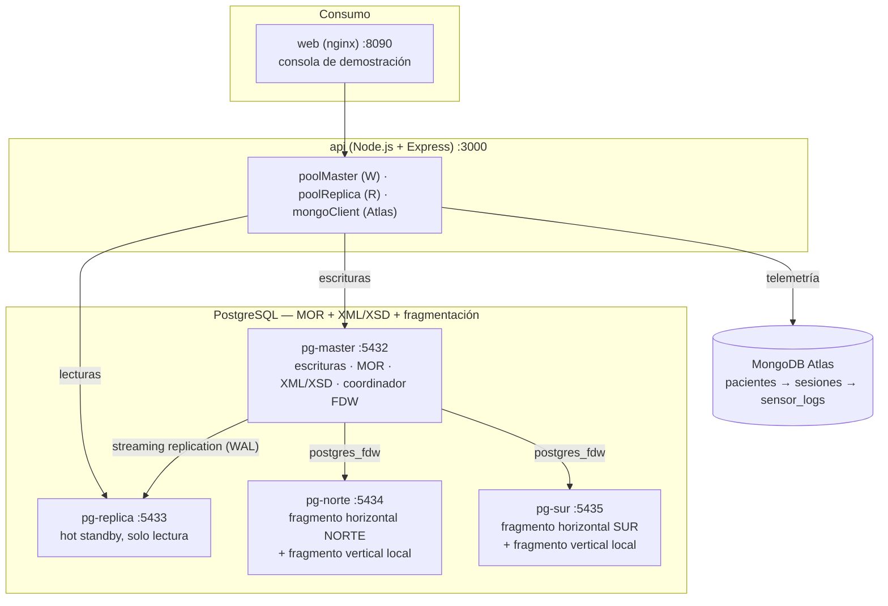

# Arquitectura — GlobalHealth Unified System

## Topología completa

## Decisiones de arquitectura

| Decisión | Alternativas descartadas | Justificación |
|---|---|---|
| PostgreSQL para MOR (tipos compuestos, tablas tipadas, herencia) | Un ORM sobre tablas planas | El enunciado exige demostrar el modelo objeto-relacional nativo del motor: `CREATE TYPE`, `CREATE TABLE ... OF`, `INHERITS`. Un ORM lo simularía en la capa de aplicación, no en el motor. |
| Validación XSD vía PL/Python3u + lxml, forzada por trigger | Confiar en el tipo `xml` nativo de PostgreSQL | PostgreSQL solo valida *well-formedness* con el tipo `xml`; no tiene `XMLVALIDATE` ni `XML SCHEMA COLLECTION`. Sin esta capa, se pierde el apartado completo de XML según la cláusula anti-plagio. |
| MongoDB Atlas (cluster real) | MongoDB local en contenedor | El enunciado exige simultáneamente modelo documental (Unidad I) y *cloud computing* (Unidad II); un Mongo local en Docker no cumple lo segundo. |
| Streaming replication física maestro/esclavo | Replicación lógica | La física copia el clúster completo byte a byte con menor *overhead* y dan un *standby* idéntico, ideal para failover; la lógica se justifica para replicar tablas selectivas o cruzar versiones de motor distintas, que no es el caso aquí. |
| `postgres_fdw` + particionamiento declarativo para fragmentación horizontal | Simular la fragmentación con un `WHERE region = ...` desde la app | El enunciado exige fragmentos que vivan en **nodos separados**; hacerlo solo en la capa de aplicación no demuestra fragmentación real a nivel de motor. |
| Dos `Pool` de `pg` físicamente separados en el backend | Un solo pool con lógica condicional (`if esEscritura ...`) | Es una restricción explícita de la cláusula anti-plagio: la separación debe ser física (host/puerto/credenciales propios), no una decisión en tiempo de ejecución dentro de un único objeto. |
| Interfaz mínima en HTML+JS vanilla, sin framework | React/Vue | El enunciado aclara que la interfaz no es lo evaluado; solo debe demostrar el consumo de una API segura. Un framework agrega superficie sin aportar al criterio evaluado. |

## Trazabilidad con la rúbrica

| Rubro de la rúbrica | Dónde se demuestra |
|---|---|
| Tipos compuestos, herencia, tabla tipada, nested tables, composición/agregación | `sql/01_mor_types.sql`, `sql/02_mor_tables.sql`, `sql/03_mor_crud.sql` |
| XML + XSD: declarar/registrar/actualizar/borrar, validación forzada, CRUD interno | `sql/04_xml_registry.sql`, `sql/05_xml_tables.sql`, `sql/06_xml_crud.sql`, `xml/samples/insertar_muestras.sql` |
| MongoDB: jerarquía, operadores, `$lookup`, agregaciones | `mongo/01_schema_validators.js`, `mongo/02_seed.js`, `mongo/03_queries_agregacion.js` |
| Replicación maestro/esclavo, caída controlada del master | `docker/master/`, `docker/replica/`, `scripts/verify_replication.sh`, `scripts/demo_replicacion.sh` |
| Separación física de conexiones en el backend | `api/src/db/pgMaster.js`, `api/src/db/pgReplica.js` |
| Fragmentación horizontal y vertical, diagramas | `sql/07_frag_horizontal.sql`, `sql/08_frag_vertical.sql`, `docs/02_fragmentacion.md`, `scripts/verify_fragmentacion.sh` |
| Cluster real en la nube, consumo por API segura | Atlas (ver `mongo/README.md`), `api/src/db/mongo.js`, TLS implícito en `mongodb+srv://` |
| Costo/beneficio cuantitativo | `docs/03_costo_beneficio.md` |
| Defensa oral: CAP/PACELC, BASE/ACID, consistencia, *replication lag* | `docs/05_banco_preguntas.md`, `docs/04_guion_defensa.md` |
