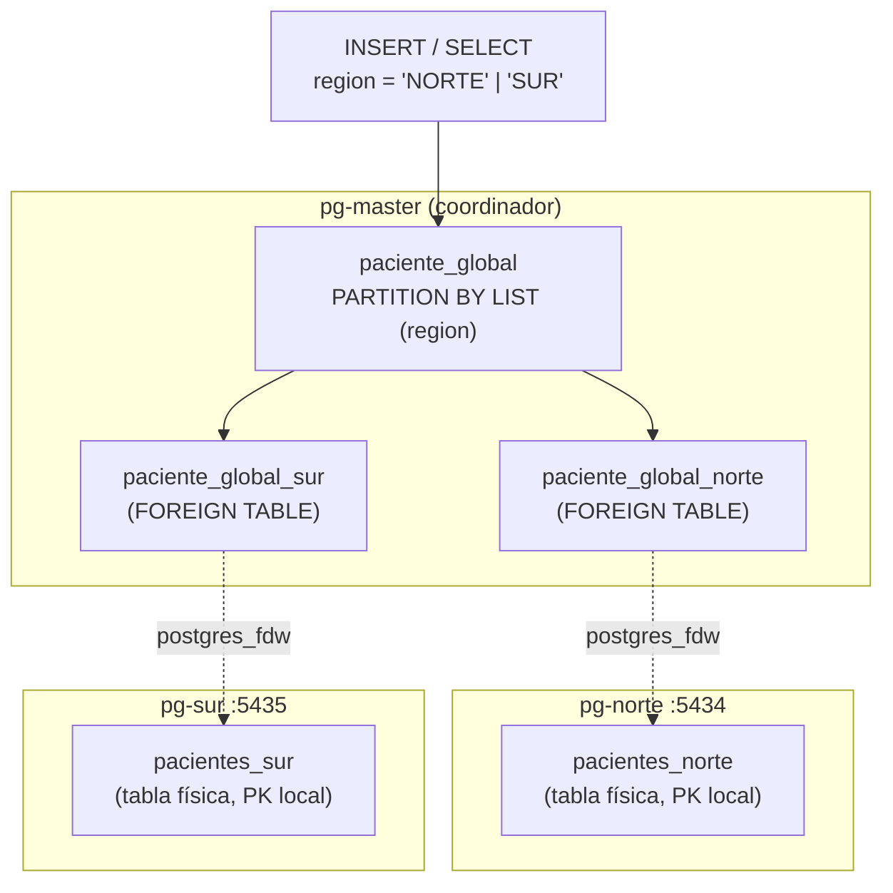
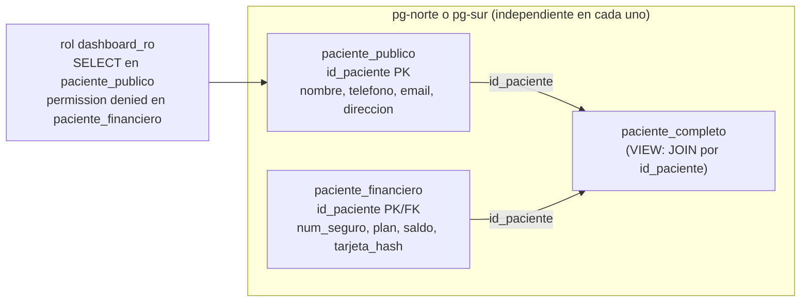

# Fragmentación distribuida

## Fragmentación horizontal — por región

`paciente_global` vive en el coordinador (`pg-master`) como tabla
particionada por `LIST (region)`. Cada partición no es una tabla física
propia: es una `FOREIGN TABLE` (vía `postgres_fdw`) que apunta a la tabla
real en el nodo correspondiente. El coordinador nunca guarda filas de
`paciente_global`; solo sabe a qué nodo reenviar cada operación.

**Enrutamiento:** un `INSERT ... region='NORTE'` en `paciente_global` baja
por la partición `paciente_global_norte` y termina como un `INSERT` remoto
en `pacientes_norte`, sin que la aplicación sepa (ni necesite saber) en qué
contenedor físico aterrizó. Verificado con `EXPLAIN` (ver
`scripts/verify_fragmentacion.sh`): un `SELECT ... WHERE region='SUR'`
genera un plan con un único `Foreign Scan` sobre `pg-sur` (*partition
pruning*); un `SELECT` sin filtrar por `region` genera un `Append` que
toca ambos nodos.

**Trampa real encontrada al implementarlo (no estaba en la lista previa del
plan):** una tabla particionada no puede tener `PRIMARY KEY`/`UNIQUE` si
alguna partición es una `FOREIGN TABLE`, porque el motor no puede verificar
unicidad a través de la red. `paciente_global` no lleva PK propia; la
unicidad de `id_paciente` se garantiza en cada fragmento físico
(`pacientes_norte`/`pacientes_sur` sí tienen su PK local).

## Fragmentación vertical — misma PK, distinto perfil de acceso

Dentro de **cada nodo** (norte y sur, de forma independiente), los datos
de un paciente se parten en dos tablas que comparten exactamente la misma
clave primaria:

`paciente_completo` reconstruye la fila original con un `JOIN` simple por
`id_paciente`. El rol `dashboard_ro` solo tiene `GRANT SELECT` sobre
`paciente_publico`; consultar `paciente_financiero` (o la vista, que
también depende de esa tabla) falla con `permission denied`, verificado en
vivo con `SET ROLE dashboard_ro`.

## Reglas de corrección de la fragmentación

| Regla | Cómo se cumple aquí |
|---|---|
| **Completitud** | Todo paciente insertado en `paciente_global` cae en exactamente una partición según su `region` (NORTE o SUR); no hay una tercera región sin partición de destino. |
| **Reconstrucción** | Horizontal: `SELECT * FROM paciente_global` sin filtro hace `UNION`/`Append` de todos los fragmentos y devuelve el conjunto completo. Vertical: `paciente_completo` reconstruye la fila con `JOIN` por `id_paciente`. |
| **Disyunción** | Horizontal: la condición de partición (`region = 'NORTE'` vs `region = 'SUR'`) es mutuamente excluyente por construcción (`PARTITION BY LIST`, un valor de `region` solo puede mapear a una partición). Vertical: no aplica en el sentido de filas duplicadas entre fragmentos — aquí la "disyunción" es de *columnas*, no de filas: cada atributo vive en un solo fragmento (público o financiero), nunca en ambos. |

Verificado programáticamente en `scripts/verify_fragmentacion.sh`:
completitud/disyunción horizontal (cada tabla física solo contiene su
región), y reconstrucción vertical lossless (`COUNT(*)` de la vista
`paciente_completo` == `COUNT(*)` de cada fragmento, ver punto 7 del script).
